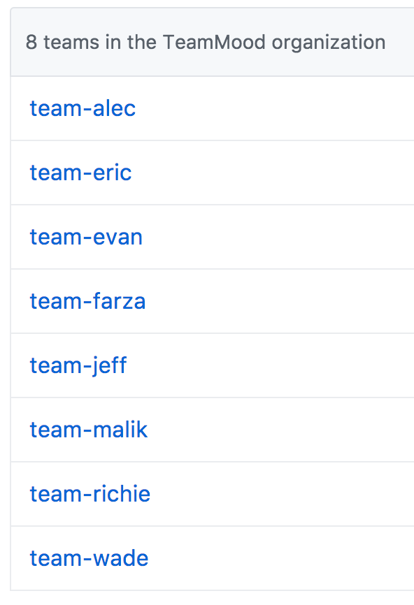

## :fire: Git gud with Git :fire:

#### 0) :rocket: Intro
As we write code with TeamMood, we use [`git`](https://git-scm.com/). We've heard that most of you already know how to use `git` and `Github`, so we'll go ahead and jump right in!

>:bulb:
[Here's](https://www.codecademy.com/learn/learn-git) a great resource for learning git, if you're still new to the game!

#### 1) :open_file_folder: Structure of our Github

As we have quite a few people working on various projects in parallel, naturally we've wanted to have some sort of structure to our Github.

##### 1.0) :crystal_ball: Transparency

First and foremost, we're a community. As such, we enable & want to foster growth, learning, and discussion between everyone as much as possible. Therefore, everyone within TeamMood will be able to have `read` access to everyone else's repos & the repos will be public. We're doing this for a couple reasons. 1) Its a great way to build your programming portfolio & showcase your work to potential employers, friends, family, etc. 2) We want everyone in the community to have the ability to ask questions, review others' code, and to keep tabs on all the cool shit that everyone else is working on. We _**encourage**_ questions and constructive feedbackn (and comments on PRs!). After all, aren't we all trying to be the best developers we can be? :100:

##### 1.1) :white_check_mark: Teams

Your mentor teams have also been translated to the teams within the [TeamMood Github Organization](https://github.com/TeamMoodGitHub), and here's a quick look at what they look like:



Since you're broken into teams, we certainly hope that you act like teams! Our mentors will be using this not just as a teaching session -- but as a way for all of you inspiring individuals to collaborate with one another.

Couple Rules:

1. This is a 100% safe space. You will treat everyone with complete respect and foster a sense of community. We're all in this together! :clap:

2. ??? TODO @ farza

These rules may be added to by your mentor, depending on their mentoring-style! :sunglasses:

#### 2) :ocean: Github Workflow

##### 2.0) :evergreen_tree: Branching

Branching is probably the most powerful tool that Github has to offer. That being said, we'll be using branching (and good branching names) to track what you're all working on!

First, how to make a branch inside your terminal / shell:
```
git checkout -b BRANCH-NAME
```
For the branch names within TeamMood, we want to keep everything consistent, so please follow this convention! You should be _cutting_ a new branch every week. (_cutting a branch_ refer to the creation of it!).
```
Branch Name: {issue_number}-{summarizing name}
Ex: 7-api-integration
```
> :bulb: Note: Prefix your branches with the associated Issues number! This way you'll _**never**_ have naming conflicts!

##### 2.1) :fork_and_knife: Forking

With each of your named repos within the teams, you should be able to fork the repo that lives on the TeamMood Github account. We encourage you all to do this for a couple reasons!

1. This is an industry standard practice! The company normally has their own account access with a version control system (like `git`), and each employee makes a fork of that repository so they're able to do with that forked repository as you like.
> :bulb: If you're not comfortable with forking, you can [learn more here](https://help.github.com/articles/fork-a-repo/)!

2. Keeps stuff with Pull Requests! Github is awesome and will recognize when you have a forked repo that can make a Pull Request!

##### 2.2) :newspaper: Issues

The way that we keep track of what you'll be working on week to week is through [Github Issues](https://guides.github.com/features/issues/). Though the name is a tad daunting at first, `Issues` just means that its an open "TODO" item, bug, or feature improvement. In the case of TeamMood, we'll be using 8 issues to track the main course of your first project, specifying what should be worked on & completed week to week.

> :bulb: You're able to quick-reference Github issues using `#issue_number` within a specific repo!

##### 2.3) :ticket: Pull Requests

The way that we'll be tracking your progress & code week to week is through [Pull Requests](https://help.github.com/articles/about-pull-requests/). Pull Requests (PR) are an _**super duper incredibly valuable**_ tool that developers use to track the code that will be merged in. We want you all to have practice with it here, so that when you get into an internship or a fulltime gig, you're already freakin' master with Pull Requests.

:mag: Some of Evan's special tips about PR's!

* After pushing to your **FORKED REPOS** branch that you're working on, Github will automagically know that you're ready to create a PR! Fantastic :smiley:

* When creating a new PR, if your mentor is super cool, they'll get you set up with a really nifty [PR Teamplate](https://github.com/blog/2111-issue-and-pull-request-templates) (and maybe one for issues too!). Go ahead by filling out the initial information in the PR, basically explaining what the PR is and what the code you're trying to merge in does.

* :exclamation: **VERY IMPORTANT** :exclamation: After creating a PR, you'll make a post in your `#team-mentor` channel accordingly, saying that you've now created a PR. As part of the team-dynamic, we require that everyone makes _at least_ 1-2 run through of their peers PR's a week and leave _**ample constructive feedback &/or questions**_ about the PR.
> :bulb: Reading others code incredibly increases your understanding of how to write **clean**, **readable**, and **maintainable** code. Being able to do each of these well is something that you really only learn during a job, so take advantage of learning this _**now**_! P.S. - Your teammates will also love the feedback & suggested changes!

* Once your PR's have been approved by one of your team members & your mentor, your mentor (and then later you) will merge the PR from your forked repo INTO the repo that lives on the TeamMood account. This will be known as the purest, cleanest, and most importantly, _**reviewed**_ state of your code.

And that's Github in TeamMood! Soon:tm: we'll provide more info on how to spice :fire: up your Github game! But first, you can start with [Github Emojis](https://gist.github.com/rxaviers/7360908) and [Markdown Syntax](https://github.com/adam-p/markdown-here/wiki/Markdown-Cheatsheet) to make all the things you write on Github LIT :fire:
